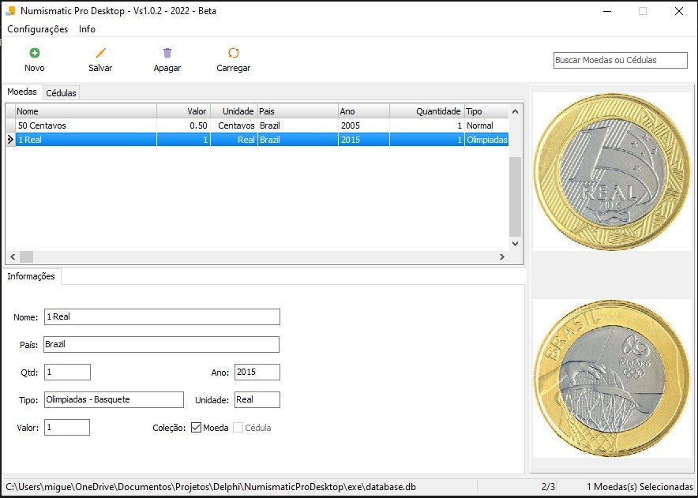

  
 

# Numismatic Pro Desktop

**💰 Aplicação Desktop Para Destinada a Colecionadores , Para Organização De Moedas e Notas Colecionáveis em Português.**
---
###  
Software Criado Baseado No [OpenNumistatic](https://github.com/OpenNumismat/open-numismat)

---

## 🚀 Tecnologias

- Delphi10
- Sqlite
- [Icons8](https://icons8.com.br/icon/set/popular-icons/color) / Pacote Popular Icons 
---
## 🛠️ Instalação

 - Baixe o Setup.exe [Clicando Aqui](https://github.com/miguelhp373/NumismaticProDesktop/raw/main/Setup/Setup.rar)
## **🎨Layout**

### 🏠 Interface

 ***
 # 📝 License

Este projeto está licenciado sob a Licença  GPL-3.0 License - consulte o arquivo [LICENÇA](LICENSE) para obter detalhes.

***
Feito com 💜 &nbsp;por Miguel Henrique 👋
